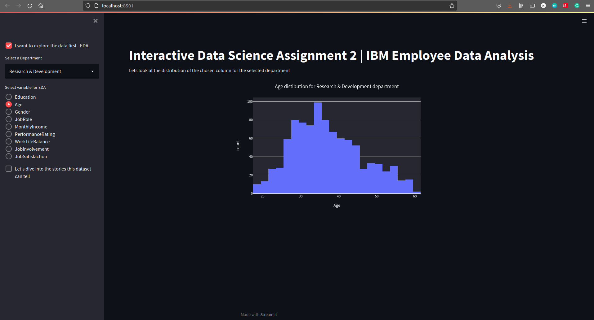
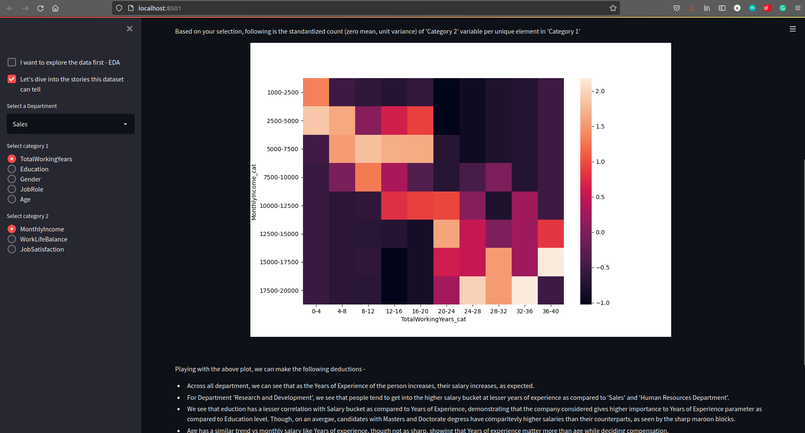

# Interactive Data Science Assignment 2 | IBM Employee Data Analysis
##### Author - Kunal Dhawan (kunaldha@andrew.cmu.edu)


## Running the application
------
```
pip install -r requirements.txt
streamlit run app.py
```

## File Structure
------

1. README.md - top level document explaining the work and the design decisions
2. app.py - Python implementation of the required Streamlit application
3. IDS_Assignment_2.ipynb - notebook containing data exploration, cleaning and EDA
4. WA_Fn-UseC_-HR-Employee-Attrition.csv - raw data downloaded from https://www.kaggle.com/pavansubhasht/ibm-hr-analytics-attrition-dataset
5. IDS_assignment2_data.csv - cleaned data as obtained from IDS_Assignment_2.ipynb
6. requirements.txt - text file containing python dependencies
7. pictures - folder containing images used in the README

## Dataset Selection Process
------

The aim of this project is to build an interactive tool that can provide some insightful deduction using the creative use of visual/graphical/tabular elements. To do this, we first have to select a dataset/ database upon which the above interaction could be built.

The points I kept in mind while selecting the dataset-
 * The dataset should represent some important/interesting phenomenon so that any visualization/processing carried over it could prove some essential insights.
 * The dataset should have multiple columns that interact with each other and have a well defined correlation with some variables of interest. This would help me make play with multilevel hierarchies or look at how multiple features interact together to bring about change in the desired variable.
 * The dataset should have >1000 and <10,000 entires, and should be sufficiently clean
 
 
Based on the above listed points, I explored multiple datasets on https://datasetsearch.research.google.com/, https://www.kaggle.com, https://labs.data.gov/ and many more. Eventually, I narrowed down my search to datasets related to 1) covid-19 (across countries, within a country with a focus on India), 2) climate change, and 3) IBM HR Analytics Employee Attrition & Performance dataset. As 3) fulfilled all the requirements jotted down above and also present me with an interesting opportunity to come up with insights in a field which we can evaluate using our common knowledge, it was finally chosen.

Dataset information -
 * Name - IBM HR Analytics Employee Attrition & Performance dataset
 * Source - https://www.kaggle.com/pavansubhasht/ibm-hr-analytics-attrition-dataset
 * Description - This is a fictional data set created by IBM data scientists to study the factors that lead to employee attrition
 * Number of columns reported - 35
 * Number of rows - 1470

An extensive EDA and cleaning of the data have been carried out in IDS_Assignment_2.ipynb. Further, the developed application also allows you to do an exploratory data analysis on certain columns of the dataset and get a good understanding of the data.  Following are a few screenshots of the EDA part of the application -





## Goals of the project 
------

The aim of the project is to understand how markers like Years of Experience, Education level of the candidate, Gender, Job Title affect important parameters like the Monthly income of the candidate, their work-life balance, and their Job satisfaction. More importantly, we would like to see if trends change over departments - Like Research and Development, Marketing, Salers, Human Resources, etc. This could help a potential candidate plan their career and help set goals for their next 5/10/15 years better. For example, if I aim to be a Research Manager in the next 10 years, what could be a more important factor - Years of experience or a higher education degree. How does salary change as a function of years of experience? How does work-life balance change as a person becomes more experienced? Is the trend the same for RnD department and Sales department? Moreover, this can also be used by us to confirm the notions/ biases we have - the monthly salary of a candidate increases as they become more experienced, work-life balance of a person in the managerial position should be worse than that of a junior developer. 


## Rationale for design decisions and an overview of the development process
------

My application has two parts - EDA and 'Stories the dataset can tell'. I'll discuss the rationales for design decisions in both parts-

For EDA-
 * As we have a total of 3 departments, that was provided as a drop-down list.
 * Next, there are two major variables - Categorical (which include Education, Gender, JobRole(note that this is a different set per department), Performance Rating, Work-life balance, Job involvement, and Job satisfaction) and Numerical (Age, Monthly income).
 * For categorical variables, as the categories are finite and small, a pie chart was the best form of representing this data. I could have also used a bar plot, but it is easier to understand the relationships between the categories in terms of the area of the section as compared to comparing the length of bars.
 For Numerical variables, I choose histograms with a large number of bins to represent the data. The length of the bars can help us compare the different categories effectively and thus I chose histograms.
 * Note that I used Plotly to create these plots, hence one can hover over the different components to get more information about the plot, making them more interactive and informative.

 For Part 2-
  * Here also, we have a drop-down list to choose one of the three departments.
  * I first distributed the variables into two categories -  
    * Category 1-

        1. Total working years (integer) - Years of experience of the candidate
        2. Job role (categorical) - The current role of the candidate at the company
        3. Education (categorical) - The education level of the candidate
        4. Gender (categorical) - The gender of the candidate
        5. Age (integer) - The age of the candidate

    * Category 2-

        1. Work life balance (categorical) - Work-life balance of the candidate
        2. Monthly salary (integer) - Monthly salary of the candidate
        3. Job Satisfaction (categorical) - Job Satisfaction of the candidate

 * Category 1 can be perceived as independent variables and category 2 the dependent variables.
 * To study the correlations between the two categories, I decided to convert the continuous data into categorical variables using binning. I ensured >=10 bins were selected for each variable, giving it more granularity. This was done so that count of people who satisfy the different label combinations of the category 1 variable and category 2 variable could be computed. This helps us come up with a matrix of dimension (num_labels_category_1, num_labels_category_2).  This count is standardized (zero mean and unit variance) over the number of labels in category 1 so as to ensure no bias creeps in during the comparison. (For example, if we had 10 people in the age range 18-22 and only 4 people in 50-54 for a chosen category 2 variable, we should look at the normalized counts for a fair comparison between the two categories.)
 * Next, this normalized count is presented as a Heatmap, where color encodes the count information. This helps to easily compare this 3-dimensional data and make inference.
 * If I hadn't done the binning for the continuous variables, I would have had to use different types of plots for comparing categorical vs categorical (could have used scatter plot), categorical vs continuous, continuous vs continuous.

 Presented below are a few screenshots of the application for part 2:





Roughly, I spent 9 hours on the project with the following distribution - 1 hr for datasets exploration, 1 hour for EDA of the datasets and understanding what questions can be answered using the dataset, 2 hours for writing the EDA part fo the streamlit app (by default streamlit was left aligning the images and also the labels for the images, had to look for tricks to overcome this issue to make the project more appealing), 4 hours on coding the part 2 of the app, specially first trying to argue what would be the best way to study the correlations, if I should perform binning or use different types of plots based on the data types of the categories, creating the count matrix programmatically in pandas so that I don't have to hard code anything (discovered a gem of a function - pd.crosstab after hours of search, this really simplifies the process) and finally using seaborn to display the results (again had to use ByteIO trick to control the size of the plot), 1 hour for cleaning the code, writing this README, and deploying the application to https://share.streamlit.io/idsf21/assignment-2-kunaldhawan/main/app.py


## Some insights from the data which were found using part 2 of the above-explained application-
------

    * Across all departments, we can see that as the Years of Experience of the person increases, their salary increases, as expected.
    * For Department 'Research and Development', we see that people tend to get into the higher salary bucket at lesser years of experience as compared to 'Sales' and 'Human Resources Department'.
    * We see that education has a lesser correlation with Salary bucket as compared to Years of Experience, demonstrating that the company considered gives higher importance to the Years of Experience parameter as compared to Education level. Though, on average, candidates with Masters and Doctorate degrees have comparatively higher salaries than their counterparts, as seen by the sharp maroon blocks.
    * Age has a similar trend vs monthly salary like Years of experience, though not as sharp, showing that Years of experience matter more than age while deciding compensation.
    * For work-life balance vs education level in Research and Development department, we observe that candidates with Doctorate degree have comparatively bad work life balance as compared to other education levels.
    * Interestingly, for the different Job Levels in Research and Development Department, we observe that 'Manager' tends to have lower job satisfaction as compared to other job titles. Similarly, for the Sales department, the "Sales Executive" position tends to have the lowest job satisfaction.
